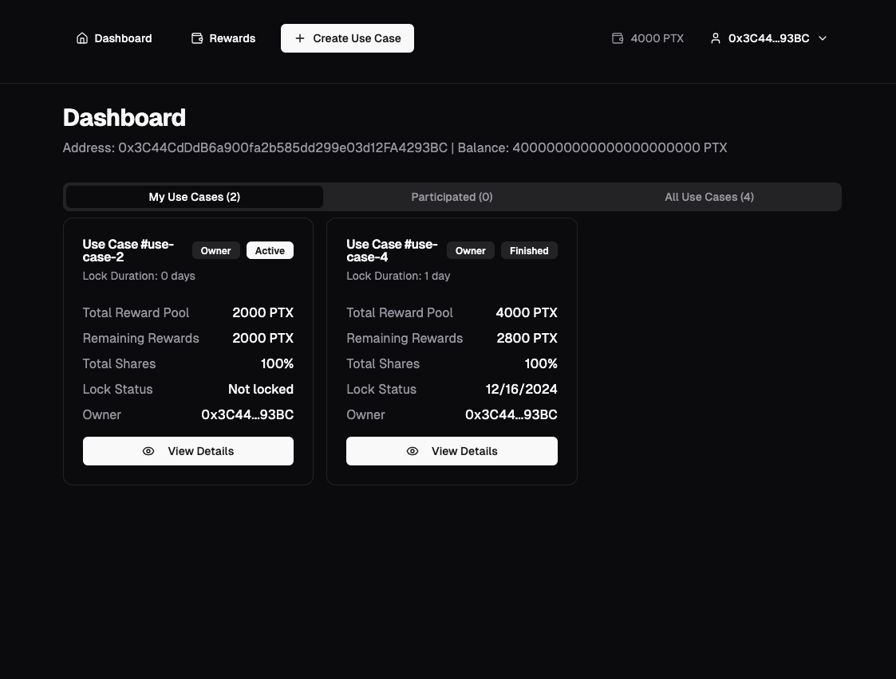
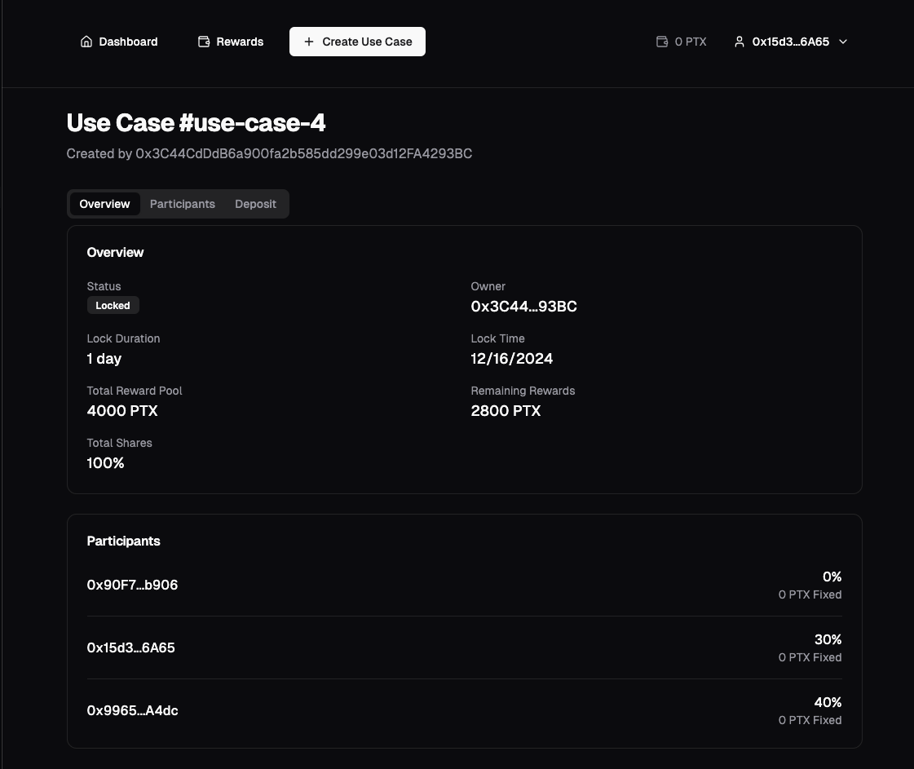
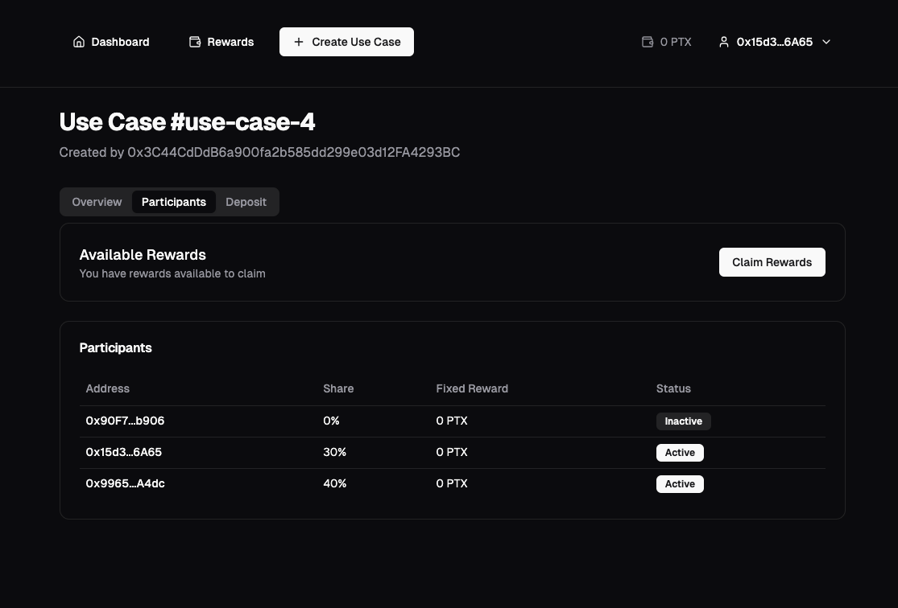
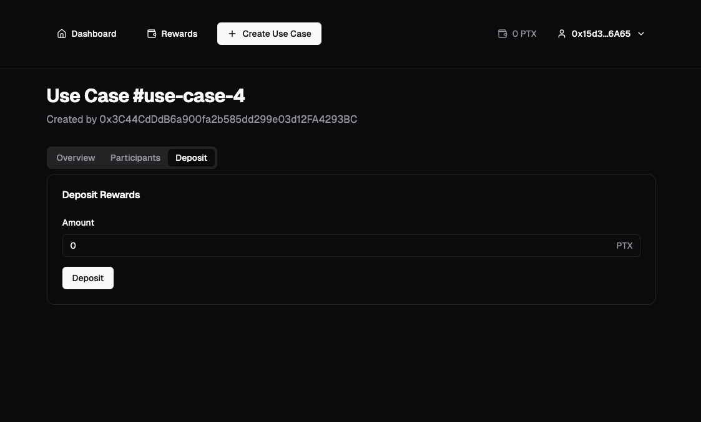
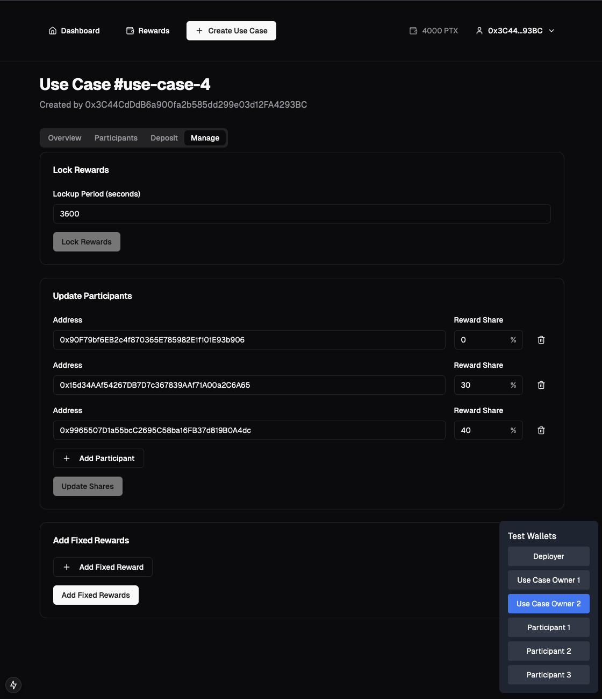
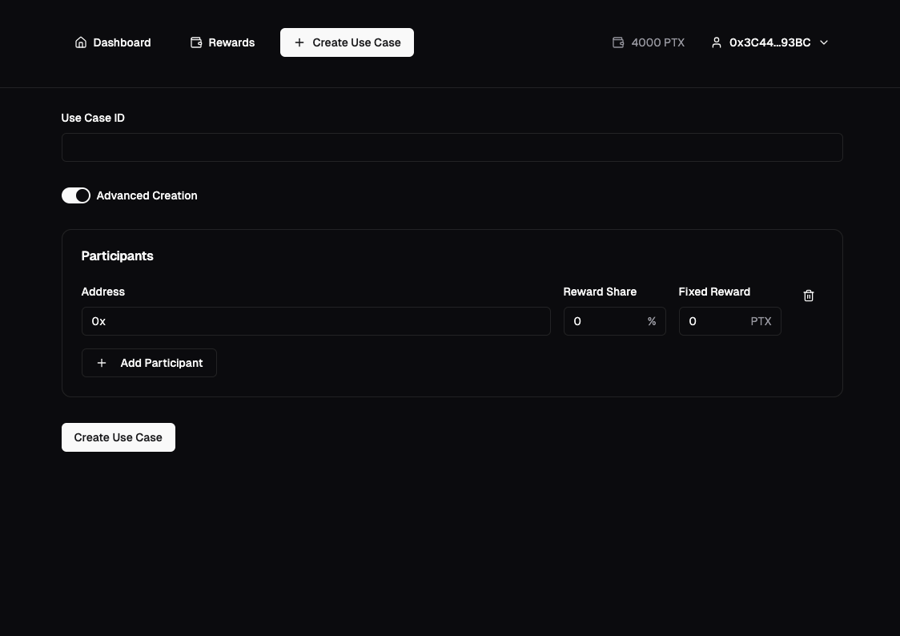

# Data value chain tracker BB

See the design document [here](docs/design-document.md).

## DVCT Core components

### DVCT Core server

- **Link to Documentation**: [docs](app/express-server/Readme.md)

### DVCT Core mongodb

DVCT Core server uses mongodb to store data.

### DVCT Core frontend

This is the React frontend application.

- **Link to Documentation**: [TBD]()

## [DVCT Incentive Blockchain](./incentive/blockchain/)

The blockchain component uses Foundry and Hardhat for development and testing. Key contracts include:

- **PTXToken**: An ERC-20 token with an ERC20Permit extension used for incentive distribution
- **UseCaseContract**: Handles use case creation and reward distribution based on shares and fixed rewards

Link to generated smart contract documentation: [docs](./incentive/blockchain/docs/src/src/README.md)

### PTX Token

Note:

- The PTX Token is a simple ERC20 smart contract.
- All tokens are minted to the contract creator (subject to change).
- Has a wrapper for transfer so that we can track distribution using the RewardTransfer event.

### UseCaseContract

Read the generated documentation for a complete overview.

The UseCaseContract manages the creation and reward distribution for use cases. Each use case has its own configuration and participants. Key features include:

#### Use Case Creation

Use cases can be created with:

- A unique identifier
- Optional initial participants with reward shares
- Optional fixed reward amounts per participant
- Initial reward pool (can be topped up later)

The contract owner can:

- Create new use cases
- Transfer use case ownership
- Update/replace participant reward shares
- Add fixed rewards
- Manage the reward pool

#### Reward Distribution

The contract implements a flexible reward distribution system:

- **Reward Shares**: Participants can be assigned percentage shares (in basis points, where 10000 = 100%)
- **Fixed Rewards**: Additional fixed amounts can be allocated to specific participants
- **Reward Pool**: A pool of PTX tokens that can be:
  - Deposited during creation
  - Topped up later
  - Distributed according to shares and fixed rewards
  - Claimed by participants when unlocked

#### Lock Duration

Rewards can be locked for a specified time by the use case owner.
Valid durations:

- Minimum 1 day
- Maximum 365 days

The lock duration allows the use case owner to control when participants can claim their rewards.

#### Security Features

The contract includes several security measures:

- Access Control: Only use case owners can modify their use cases
- Reentrancy Protection: Uses OpenZeppelin's ReentrancyGuard
- Input Validation: Comprehensive checks for parameters like shares and reward amounts
- Safe Token Transfers: Uses OpenZeppelin's SafeERC20 for token operations
- Emergency withdrawal of reward pool if contract is not locked yet (only use case owner)

### Scripts

Workspace:

- `yarn start:node` - starts the local hardhat node

Project:

- `yarn ptx-deploy` - Deploys the contracts to the local hardhat network
- `yarn ptx-deploy-test` - Deploys contracts and a test environment where many transactions has been made. Useful for frontend development.
- `yarn export-abis` - Export the contract abis to the incentive frontend
- `yarn export-abis-to-api` - Export the contract abis to the incentive api
- `yarn docs` - generates solidity docs using forge
- `yarn clean` - cleans the hardhat workspace

## [DVCT Incentive Frontend](./incentive/frontend/)

Built using Next.js, Tailwind CSS, Shadcn, wagmi, viem. Providing interfaces for:

- Use case management
- Reward distribution monitoring
- Claiming rewards
- See balances and other statistics

Right now this is a simple website that lets you connect your wallet. From you wallet you will get an overview of your created use cases, use cases you have participated in, and all use cases. From there you can enter a specific use case. Here you will get information about the remaining reward pool, pausing, lock duration etc. You will see all participants, and how they have participated. Participants will be able to claim their reward when the lock is finished. Owner will be able to revert (single or batch) rewards, if the lock is still up. Plus some other small things.

You will also be able to create a use case in this UI. This is in development. This will most likely not be something you do through this UI, but rather in the overall Use Case creation process. Hopefully, this ui can provide a good starting point for the developers of the use case form.

### Scripts

Workspace:

- `yarn start:incentive:frontend` - starts the next.js app

## [DVCT Incentive API](./incentive/api/)

The API provides endpoints for:

- Secure reward distribution
- Historical data access (TBD)
- Real-time information (TBD)
- Aggregated statistics (TBD)

We did have some mock endpoints for the information api's, but I removed those, as I don't see their use. We should create proper history and statistics api's for what is going on in the api, and what is going on in the blockchain. This has been down prioritized to focus on the main functionality.

### Endpoints

- `api/incentives/distribute`

### How it works

The aim of the incentive api is to provide simple access to the smart contracts through a normal api, but still retaining the security. For this we have created a **KeyManagementService**. It manages client authentication and authorization through public-key cryptography.

**KeyManagementService** overview:

- Generates 2048-bit RSA key pairs
- Associates keys with client IDs
- Stores public keys and permissions
- Returns private key for client distribution (centralized management)
- Validates if clients have specific permissions
- Clint management (public key retrival, access revocation etc)

**IKeyStorage**: Interface used for the storage implementation. We will probably use a cloud-based secure key-value vault in production. We created this interface so that it is easy to swap storage solutions. Right now we have only implemented a **FileKeyStorage**, used for testing.

**IncentiveService**: This is the core incentive distribution service. This handles a request by validating the request, verifying the signature, and if all is good, then submits the transaction to the blockchain. Meaning that the wallet connected to the incentive api is paying for gas. This is to be seen as a direct operational cost, and can be reduced by using the **notifier** concept we discussed above.

### Tools/clients

**Incentive signer**: We have created a a client library that exposes a signer, so that it is easy for clients to create a signature that matches what we expect in the api. This needs to be signed with the private key that we provide to them.

**addClient script**: This is a simple script used to add new clients. Just for ease-of-use. It uses the local FileStorage implementation.

### Scripts

Workspace:

- `yarn start:api` - starts the express server
- `yarn build:api` - builds the api

## Testing

### Prerequisites

- Node.js >= 18.0.0
- Yarn or npm
- [Forge](https://book.getfoundry.sh/getting-started/installation) (if you want to run the blockchain unit tests)

Run `yarn deps` to install all dependencies. Or `npm run deps-npm` if you are using npm.

### E2E testing

- `yarn test:integration:only` (assumes you have node running)
- `yarn test:integration` (runs hardhat node concurrently)

### Integration tests

- `test:blockchain:hardhat` (integration like hardhat test for the smart contracts)

### Unit tests

- `test:blockchain:forge` (unit tests that tests the smart contracts)
- `test:incentive:api` (unit tests for the incentive api)

## Makefile Commands

The following commands can be used to manage the services defined in `docker-compose.yml`.

### Prerequisites

Make sure you have the following installed on your machine:

- [Docker](https://docs.docker.com/get-docker/)
- [Docker Compose](https://docs.docker.com/compose/install/)
- [Make](https://www.gnu.org/software/make/)

### `make up`

Starts all services defined in the Docker Compose file.

```bash
make up
```

### `make down`

Stops all services defined in the Docker Compose file.

```bash
make down
```

### `make clean`

Cleans up containers, networks, and volumes created by Docker Compose.

```bash
make clean
```

### `make logs`

Displays logs for all services defined in the Docker Compose file.

```bash
make logs
```

### Individual Builds
- `make build-core-frontend` - Builds the core frontend Docker image
- `make build-core-api` - Builds the core API Docker image
- `make build-incentive-api` - Builds the incentive API Docker image
- `make build-incentive-frontend` - Builds the incentive frontend Docker image
- `make build-hardhat` - Builds the Hardhat node Docker image# Individual ddimage build commands


## Frontend pictures







