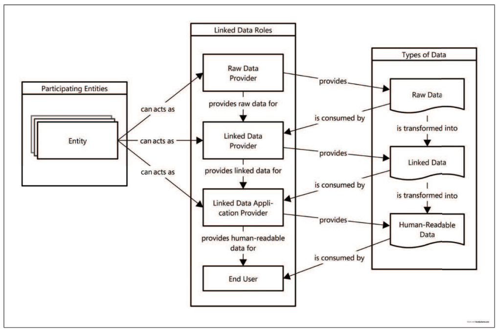
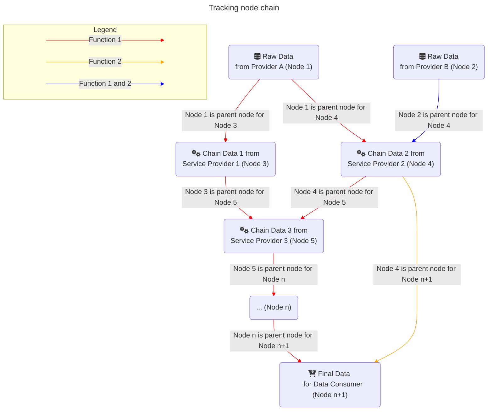
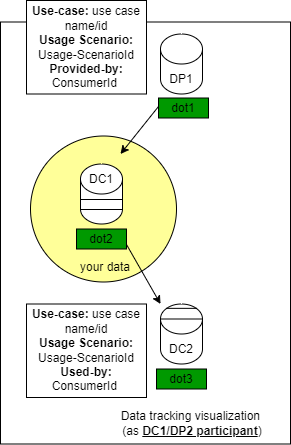
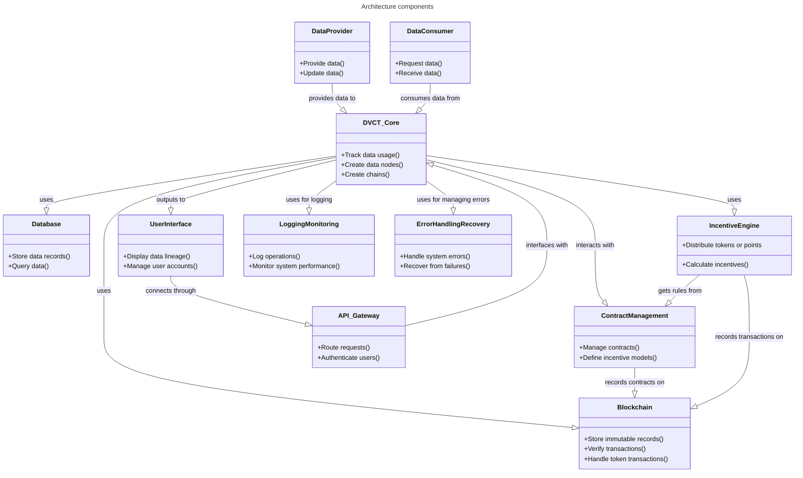
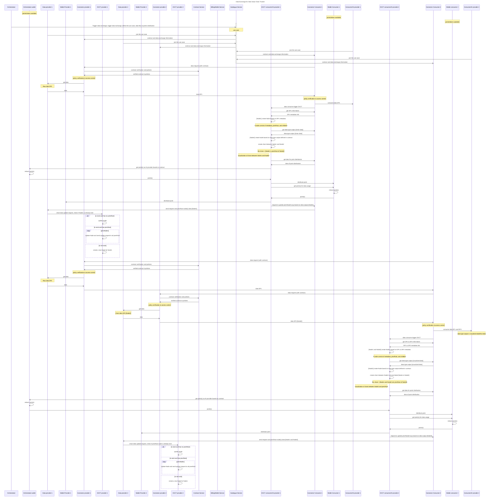
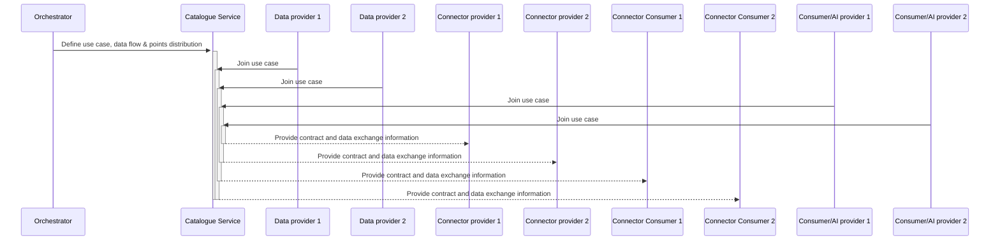
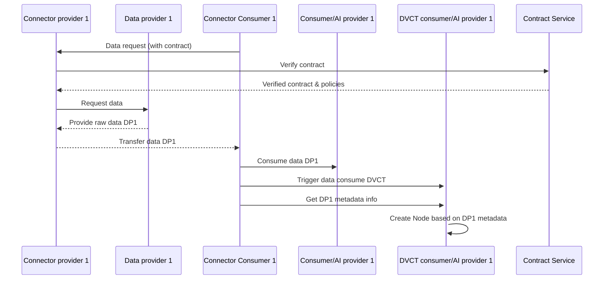
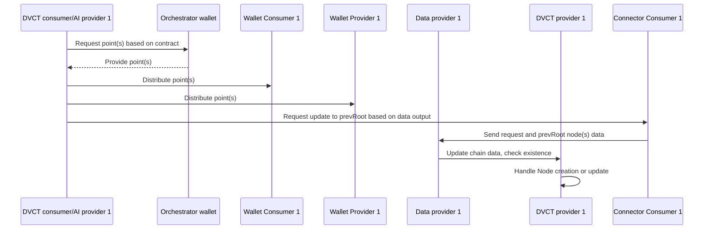
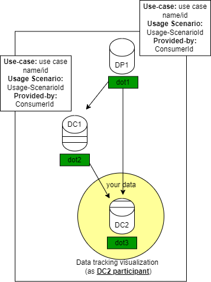
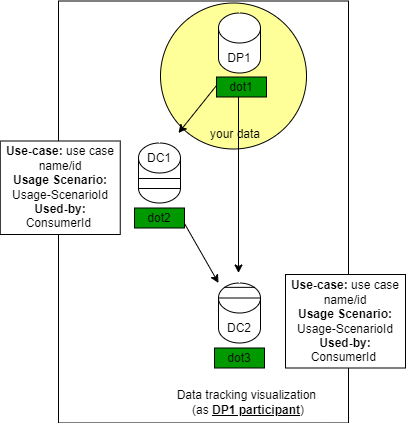

# Data value chain tracker BB – Design Document

The Data Value Chain Tracker (hereafter DVCT) is a service that monitors and distributes digital incentives for data usage. DVCT ensures traceability and accountability of data usage, as well as enables organizations and individuals to realize the value of their data.

As data provider or data owner, organization and individual can use DVCT to find out which use case(s), when, how, and by whom their data was used, as well as what other data affected the process of making new data type/items. 

Data providers (individuals or organizations) get an overview of where their data is used and can obtain information about the value of their data in the ecosystem, this can help them to better negotiate their data and service offering. In addition, by tracking the use of data in the ecosystem, the DVCT will handle the distribution of digital incentive to the organizations that participate in the value co-creation of the data usage.

## Conceptual Overview

According to Latif et al. (2009), there are three different types of data that contribute to the creation of the value chain. These are raw data, linked or chain data and consumer data (human readable). By identifying these three types of data, the DVCT can create the chain based on the parent and child nodes.


source: Linked data value chain (Latif et al., 2009)

A node represents the data processing or the activity that takes place from data provision to visualization. To construct the data usage chain node, the data origin for the data processing must be determined. Each data processing represents a child node that is connected to one or more data sources (parent nodes). A parent node can have several child nodes.
As a parent node, a data provider offers raw data, which is then processed by one or more child nodes before being delivered to the data consumer.


From the "tracking node chain" image, a use case has for example two analytics functionalities, each of this functionalities requires different Data and AI Services. For the function 1, Nodes 3 and 4 are using the data directly from Node 1, while Node 5 and Node n are indirectly using the data from Node 1.

To encourage data sharing, digital incentives should be provided to the ecosystem. These digital incentives can be used to convert the "value" of data sharing into a valuable asset that can be used for various activities within the Promotheus-X (PTX) ecosystem. DVCT act as tool to distribute the digital incentives based on data usage of participants.

For incentives distribution, the prerequisites are:
1. The number of points (as representative of the data value) to be distributed for data and service providers must be predefined in the contract.
2. As a default, points will be awarded in full (factor = 1, factor will be between 0.0 - 1.0), unless specified in the contract to check data quality (factorCheck = false). Here, the factor will be calculated with the support of the Data Veracity Assurance building block.
3. Except for raw data, information regarding previous service data processing (based on a contract) or data origin (from dataspace catalog) must be included.
4. Incentives should be defined in a catalog, similar to the business model for offers, where organizations can specify prices for their offers (additional input fields related to points/tokens for offers and use cases).

## Technical Usage Scenarios & Features

One of the DVCT's goals is to address the issue of data value ambiguity by giving an overview of data utilization, both direct and indirect. Technical usage scenario and role of the DVCT can be described in the table below:

| Process                                                                                                                                                               | DVCT role                                                                                                                                                                                             | Scenario for Incentive mechanism                                                                                                                                                                                      |
| --------------------------------------------------------------------------------------------------------------------------------------------------------------------- | ----------------------------------------------------------------------------------------------------------------------------------------------------------------------------------------------------- | --------------------------------------------------------------------------------------------------------------------------------------------------------------------------------------------------------------------- |
| Use Case Orchestrator defines the use case (data flow, point distribution including where the point coming from, number of point(s) to provide, data/AI requirements) | Extracting information from the contract about the data flow (participant's role, data usage and type of data usage) and the distribution of points                                                   | As a use case leader, I can offer points/incentives to service providers who join my use case in order to expand my network.                                                                                          |
| Data providers share data with data consumers/AI providers on the basis of the contract                                                                               | Interaction with the dataspace connector and contract service, generation of nodes and the chain after data consumption/usage                                                                         | As a provider, I can define in the catalog how many points/incentives I would expect for using my data or using my services                                                                                           |
| Data consumers/AI providers who consume data and bring the result of their AI service back into the ecosystem as aggregated data/chained data                         | Create and store immutable json data consisting of nodes that identify prevNode/rawdata and children                                                                                                  | As a data consumer, I can offer points or incentives for data and AI providers to improve combine, and improve my raw data. As an AI provider, I can offer points for data providers in order to improve my AI model. |
| Participant (Use Case Orchestrator or data consumer) sets number of point(s) for data usage in the contract and catalog                                               | Interaction with the contract, the digital wallet of the point/token giver and distribution of point based on the contract (point sources, who will get the point, and number of point to distribute) | Use case participants will get incentive information about the use case on the catalog, and the use case leader can define the value exchange items: are organizations paid, do they receive tokens, or both?         |
| Data providers want to know where their data was used                                                                                                                 | Read the json data node, interact with the data visualization to create the value chain.                                                                                                              |                                                                                                                                                                                                                       |
| AI Provider join a use case                                                                                                                                           | Read use case contract to get information about incentives for AI provider to join a use case                                                                                                         | As an AI provider, I can offer points for data providers in order to improve my AI model.                                                                                                                             |

In relation to the Dataspace Governance Principles defined by IDSA (IDSA applies four core governance principles: Accountability, Transparency, Fairness and Responsibility. Source: [International Dataspace (IDSA)](https://docs.internationaldataspaces.org/ids-knowledgebase/v/idsa-rulebook/idsa-rulebook/2_guiding_principles), The principles are join work between different BBs, and the DVCT will focus on ensuring _transparency_ and _accountability_ through an immutable database and tracking of data usage.

DVCT does not include rules on how the initial tokens are generated as this is outside the scope of building blocks, the data space that determines how DVCT can acquire tokens. Also, regarding the amount of incentives to be distributed, this is at the use case level, which will be determined by the use case participants in their business model.

### Features/Main Functionalities

Based on the DVCT objective and technical usage scenario, there are three key functionalities for the BB, the key functionalities are:

1. Track the history of direct and indirect data usage of shared data
2. Handle the distribution of digital incentives (in terms of points, tokens, badges, or labels) based on the contract.
3. Provide data for visualization of value chain tracking (forward and backward tracking).

## Requirements

Some requirements for the DVCT are based on the DVCT objectives, the technical usage scenario, the initial conceptual overview and GAIA-X and IDSA, including\*:

- **`[BB_06__01]`** DVCT MUST support tracking direct and indirect data usage
- **`[BB_06__02]`** DVCT MUST interface with the Contract
- **`[BB_06__03]`** DVCT MUST support distributed data storing the value chain data (data-usage history)
- **`[BB_06__04]`** DVCT SHOULD have access to points/token storage
- **`[BB_06__05]`** DVCT MUST store points/tokens and data-usage-history in immutable database
- **`[BB_06__06]`** DVCT SHOULD distribute points based on the contract
- **`[BB_06__07]`** DVCT SHOULD provide visualization of data value chain (data-usage history)
- **`[BB_06__08]`** DVCT SHOULD interface with the Distributed Data Visualization Building block
- **`[BB_06__09]`** DVCT MUST interface with the Data Space Connector
- **`[BB_06__10]`** DVCT SHOULD support tracking history up to 3 level of indirect usage

_\*To be further discussed with Félix and Robin_\
_\*To be validated with use case partners & pool of experts_\

## Distribution of incentives in DVCT

The objective of the distribution of incentives in the DVCT is to design and
implement a system for distributing incentives within a data value chain tracker
using smart contracts. The orchestrator or other entity wallet will provide the tokens/points based on the contract
and the DVCT smart contracts will distribute the tokens/points to providers and consumers.

### Incentive for network participants

We will incentivize data providers, AI providers and contributing consumers based on their contribution to the use case. It will largely operate based on contracts provided by use-case orchestrators. Using smart contracts we will ensure fairness, transparency and security in the distribution of tokens. We also hope to see potential for new incentives and business models, exploring novel ways to incentivize and capitalize on existing data flows.

### Smart contracts

The smart contracts will facilitate the distribution of tokens. Some of its parameters will be defined from the contract bb, where we get information about a participant’s role, data usage terms, type of data usage and the distribution of points. This ensures consistency and interoperability across the prometheus-x ecosystem. This needs to monitor the direct and indirect use of data for a given use case to be able to distribute tokens correctly. The mechanisms for payment and incentive distributions are integrated directly into the smart contracts, ensuring fair and transparent compensation for data providers based on the value of their contributions. We might need to collaborate with some use-case orchestrators to define the contract parameters accurately, considering the specific requirements of each use case.

### DVCT Responsibilities

The DVCT is responsible for distributing the incentives and storing metadata about how the incentives should be distributed.
It is responsible for the component that listen to events that signifies a reward should be distributed, and then contacts the smart contract for the actual distribution.
It is responsible for the smart contract that handles distribution and communication with wallets as described in the section above.
It is responsible for the wallets in the ecosystem. We will provide every relevant actor with a wallet and some points/tokens to play with.
This will be a limited wallet implementation meant to serve the purpose of the DVCT for testing purposes.
However, the DVCT is not responsible for adjustments needed in the dataspace contract creation.
Here, the contract creator will need to be able to connect his wallet, and sign a message making some tokens available for the DVCT smart contract.
The contract BB will handle this.

### Additional points

#### Token Revocation

A mechanism to revoke tokens from actors who violate contract terms or engage in faudulent activities.
Implemented in incentive component and smart contract.
For this to be possible the tokens can not be directly transferred to the actors wallet, but rather allocated to them for later verification.
Assuming user-managed wallets we are not able to access the tokens after sending them.

#### Fiat conversion

The conversion of tokens to fiat is out of scope for the DVCT building block.
This functionality should be defined by the dataspace, possibly through integration with payment gateways or exchange services.

#### Use of Polygon

Polygon is chosen for its scalability, low transaction costs, and security.
It is also a good choice as other BBs (Identity, Wallet) have built on Polygon.
Information stored on the blockchain includes transaction records, token balances, and some metadata.

### Example Incentives

To better understand how points can be distributed in the ecosystem, let's take a look at example incentives that could be used
* As a use case orchestrator, I can provide X points to the Data or Service Provider when they join my use case
* As a use case orchestrator, I can provide X points to a Data Provider after a successful transaction
* As a Data Provider, I can provide X points to a Service Provider after a successful response from their service

> These are only a sample of all the incentives that could be used for token distribution with the DVCT

## Integrations

In order to make the BB function, the integration with other BB is expected:

### Direct Integrations with Other BBs

- _Catalog._\
  The DVCT requires input fields in the catalog so that providers can enter the number of points they offer/expect for their data/services. These input fields are additional information to the price defined in the catalog and in the contract.

- _Contract._\
  The DVCT needs to get data from the contract about the contract identifier, the data used/transferred and the share of the distribution of digital incentives. The information forms the basis for the distribution of digital incentives after the data usage process.

- _Distributed data visualization._\
  The DVCT will provide node and chain data that need to be visualize to the data owner, this will help data owner to get overview regarding the value/usefulness of their data within different use case or PTX data space. The visualization can be shown in different places for example in the catalog.

- _Billing or Digital wallet._\
  The DVCT needs access to the points/token holders of the point/token givers defined by orchestrators/contract participants that provide digital incentives to their use case. The DVCT will get information about the incentives from the contract, and responsible for distributing the points in an immutable database (Blockchain and Digital Wallet).

- _Data veracity assurance._\
  The data veracity BB will focus on the data quality. Even though the DVCT
  will not access the data that is being shared between participants, it will
  work with metadata. It might be relevant to assess the quality of the
  metadata itself by some common criterias like completeness, data anonymity, timeliness etc.
  We should also consider the possibility of automating this process if this
  falls within the scope of this BB.

### Integrations via Connector

- DVCT will need to be integrated directly into the **Connector** to extend the data exchange flows and perform the smart contract process to update the DVCT containing the value chain.
  Where applicable the **Connector** will ping DVCT for token distribution before making data accessible.

## Relevant Standards

- [Decentralized identifiers (DIDs)](https://w3c.github.io/did-core/) to allow verifiable, decentralized digital identity.
- [ISO 8000-117](https://www.iso.org/standard/81208.html) for data quality and immutability of distributed ledger including Blockchain
- [EIP-1155](https://eips.ethereum.org/EIPS/eip-1155) for incentive distribution

### Data Format Standards

- [JSON-LD](https://json-ld.org/) for data interconnection
- [ISO 8601](https://en.wikipedia.org/wiki/ISO_8601) for Date and time format

### Mapping to Data Space Reference Architecture Models

**DSSC** - based on DSSC, this Building block is part:

- [Data Provenance Tracking](https://docs.internationaldataspaces.org/ids-knowledgebase/v/ids-ram-4/perspectives-of-the-reference-architecture-model/4_perspectives/4_1_security_perspective/4_1_6_usage_control#data-provenance-tracking) architecture model
- the [Provenance & Traceability](https://dssc.eu/space/BVE/357075283/Provenance+%26+Traceability) building block
- [Value-Added Services](https://dssc.eu/space/BVE/357076468/Value-Added+Services) building block.
- [GAIA-X: Technical Architecture](https://www.bmwk.de/Redaktion/EN/Publikationen/gaia-x-technical-architecture.pdf?__blob=publicationFile&v=7) regarding data ecosystem in section 4.2

**IDS Data Sharing and data exchange:** see [2.4 Data Exchange and Data Sharing](https://docs.internationaldataspaces.org/ids-knowledgebase/v/ids-ram-4/context-of-the-international-data-spaces/2_1_data-driven-business_ecosystems/2_4_data_exchange_and_data_sharing).

## Input

### Input data:

```json
{
  "dvctId": "connector_id",
  "usecaseContractId": "use_case_contract_id",
  "usecaseContractTitle": "use_case_contract_title",
  "extraIncentiveForAIProvider": {
    "numPoints": 10,
    "factor": 1,
    "factorCheck": false
  },
  "contractId": "contract_id",
  "dataId": "data_id",
  "dataProviderId": "data_provider_id",
  "dataConsumerId": "data_consumer_id",
  "dataConsumerIsAIProvider": false,
  "prevDataId": "data_id",
  "incentiveForDataProvider": {
    "numPoints": 5,
    "factor": 1,
    "factorCheck": false
  }
}
```

### Data Value Chain Tracker visualization

- Visualization of value tracking for provider of chain data:  
  

### Data Value Chain Tracker digital incentives distribution

The distribution of digital incentives distribution should be based on the contract, defined by the use case orchestrator or between data provider and data consumer. Example of incentives json input defined within the contract:

**incentive for AI provider**

```json
{
  "extraIncentiveForAIProvider": {
    "numPoints": 10,
    "factor": 1.0,
    "factorCheck": false
  }
}
```

**incentive from data consumer to data provider**

```json
{
  "incentiveForDataProvider": {
    "numPoints": 5,
    "factor": 1.0,
    "factorCheck": false
  }
}
```

To further develop the integration of other aspects (e.g. data quality) for the incentive mechanism, the factor percentage (0.0 to 1.0) and the factorCheck object are added. By default, the incentive points are awarded in full (factor = 1,0) and without further checking of the incentive effect.

## Architecture

### Component Descriptions:

1. **DataProvider:** Entities that supply data to the system.
2. **DataConsumer:** Entities that use data provided by DataProviders.
3. **DVCT_Core:** Central logic component that tracks data usage, creates data nodes and chains between data usage nodes.
4. **Blockchain or any immutable database:** Ensures data immutability and transaction verification.
5. **Database:** Stores non-blockchain data records and manages queries.
6. **UserInterface:** Provides visualizations of data lineage, data usages information, points/token information and manages user interactions.
7. **ContractManagement:** Manages digital contracts that define incentive models.
8. **API_Gateway:** Manages all incoming and outgoing API requests and handles user authentication.
9. **Incentive Engine:** Handles the calculation and distribution of tokens or points as per contractual agreements.
10. **Logging and Monitoring:** Records system activities and monitors performance to ensure optimal operation and aid in troubleshooting.
11. **Error Handling and Recovery:** Implements strategies to manage system errors and restore normal operations after failures, ensuring system resilience and reliability.



for the initial implementation, immutable database non-blockchain will be used before the wallet BB is ready.

## Dynamic Behaviour

The sequence diagrams below describe possible DVCT to the basic B2B Connector flows.

_To be discussed with Félix and Robin_



To make the diagram smaller, more manageable parts, ensuring it remains comprehensible and easy to follow on smaller screens, we devided the process into different main processes:

- **Part 1:** Initiating Data Exchange and Basic Data Handling



- **Part 2:** Data Usage and Node Creation



- **Part 3:** Incentive Distribution and Chain Update



## Configuration & Deployment Settings

The configuration and deployment setting for Data Value Chain Tracker (DVCT), consist of:

1. Repository Setup: the source code will be hosted on GitHub or GitLab, allowing for version control and collaborative development.
2. Configuration Management: Environment variables for sensitive or environment-specific settings (e.g., database credentials) should be centralized in specific files, employ configuration files (like config.json, .env, or YAML files) to manage application settings, which can be easily adjusted without changing the code.
3. Dependency Management: Utilize a package manager such as npm for JavaScript or pip for Python to manage libraries and their versions. a requirements.txt or package.json file should be included to automate the installation of dependencies.
4. Database Configuration: Set up a relational or NoSQL database with scripts for initialization and migration. Tools like Docker can be used to containerize database environments, enhancing portability and consistency across development, testing, and production environments.
5. Deployment:Use continuous integration/continuous deployment (CI/CD) pipelines via GitHub Actions, to automate testing and deployment. Use container orchestration tools like Kubernetes or Docker Swarm.
6. Monitoring and Maintenance: Implement logging and monitoring using tools like Prometheus, Grafana, or ELK Stack to keep track of the system’s health and performance. Regular updates and security patches to dependencies should be managed through the chosen package managers and monitored via the CI/CD pipeline.

## Third Party Components & Licenses

- Immutable Database:
  Component: Use an immutable database like Apache Cassandra or a blockchain-based storage solution.
  License: Apache Cassandra is available under the Apache License 2.0, which allows commercial use, modification, distribution, and private use.

- MongoDB Node.js Library:
  Component: MongoDB Node.js driver for database operations.
  License: The MongoDB Node.js library is released under the Apache License 2.0.

- Open Source Blockchain:
  - Component: Polygon (Ethereum L2 scaling solution) is the preferred blockchain solution as other BBs in the ecosystem have already utilized it.
  - License: Most tools and libraries in the Polygon ecosystem are open-source, typically under the MIT License, which allows for free use, modification, and distribution.

## Implementation Details

### Incentive distribution

This section describes implementation of the incentive distribution.
It is subject to change during implementation.

#### Polygon Wallets

- Ensure every participant has a Polygon wallet. This is necessary for interacting with smart contracts and handling ERC20 (or similar) tokens.
  As described above the DVCT will be responsible for the wallets.

#### Contract Creation

- **Define Incentives:** When the orchestrator creates the dataspace contract he specifies whether the token point incentives are included.
- **Point Allocation:** During contract creation, the orchestrator can allocate points to three actions: joining the use case, providing data, and providing services.
  These points should be represented as an ERC20 (or similar) token.

#### Token Allocation

The implementation could include one of the two, or a combination of both.
As described above, the contract BB will be responsible for wallet connection and signing approval or deposit of tokens during the contract creation process.

- **Initial Deposit:** Require an initial deposit of tokens from the orchestrator's wallet to the smart contract.
  This ensures that the contract has tokens available for distribution.
- **Approval Mechanism:** Implement an approval mechanism where the orchestrator grants the smart contract the ability to withdraw a specified number of tokens.
  This could be done using the ERC20 _approve_ or _transferFrom_ functions.

#### Tracking and Distribution

- **Action Tracking:** Implement a tracking system that monitors the DVCT (or integrate directly into the DVCT core) that identifies when a participant has joined the use case, provided data, or provided a service.
- **Token Transfer:** Based on the tracked actions, the smart contract will transfer the appropriate number of tokens from the orchestrator's wallet to the relevant participant's wallet.
  This can be triggered by specific events detected by the tracking system.

#### Key Considerations

- **Automated Distribution:** Use oracles or on-chain/off-chain hybrid systems to automate the verification of actions(joining, data provision, service provision).
- **Gas:** Ensure that the smart contract is designed to handle a large number of transactions efficiently.
  Consider the gas fees and optimize the contract to minimize costs. Even though Polygon gas fees are small, we need to decide whether the sender or receiver will pay for gas fees.
- **User Interface:** We will need some small user interfaces. For example to manage your wallet, see status and stats, and maybe some smart contract interaction. This has not been finalized.

## OpenAPI Specification

<!-- TODO -->

## Test Specification

### Test Plan

The test plan for the Data Value Chain Tracker (DVCT) aims to ensure the system's integrity and performance through a comprehensive approach. It includes correctness tests for accurate data representation, reliability tests for system stability and data integrity, tests data immutability and scalability, back and forward tracking tests to verify accurate data lineage, and incentives distribution tests to ensure compliance and fairness based on contractual agreements.

To check the result of the value chain creation, the DVCT should create a node for the data usage in **output data** json format after the data is used on the data consumer side (PDC consumer will trigger DVCT). Each time information about the prevDataId is present in the input data, the DVCT checks whether the prevDataId already exists (as a nodeId) within the value chain node. If this is the case, the childNode of the prevDataId is updated with the new dataId as a child node.

**Output data:**

```json
{
  "nodeId": "node_id",
  "dataId": "data_id",
  "nodeMetadata": {
    "dvctId": "connector_id",
    "usecaseContractId": "use_case_contract_id",
    "dataProviderId": "data_provider_id",
    "dataConsumerId": "data_consumer_id",
    "incentiveReceivedFrom": [
      {
        "organizationId": "organization_id",
        "numPoints": 5,
        "contractId": "contract_id"
      },
      {
        "organizationId": "organization_id",
        "numPoints": 5,
        "contractId": "contract_id"
      }
    ]
  },
  "prevNode": [
    { "nodeId": "node_id", "@nodeUrl": "https://url-to-nodeId/nodeId" },
    { "nodeId": "node_id", "@nodeUrl": "https://url-to-nodeId/nodeId" }
  ],
  "childNode": [
    { "nodeId": "node_id", "@nodeUrl": "https://url-to-nodeId/nodeId" },
    { "nodeId": "node_id", "@nodeUrl": "https://url-to-nodeId/nodeId" }
  ]
}
```

### back and forward chain tracking

Back and forward chain tracking in the context of the Data Value Chain Tracker (DVCT) refers to the system's ability to trace data usage throughout its lifecycle. Forward tracking enables monitoring of how data is used, transformed, or combined from its initial state to subsequent states, including indirect usages in various use cases. It helps determine where, when, and in which use case the data was utilized.

Backward tracking, on the other hand, allows tracing back to the data's origin up to three levels, identifying the primary source and any intermediate stages it has passed through. This feature ensures transparency and accountability in data handling, allowing stakeholders to see both the downstream implications of data they provide and the upstream origins of data they use. This capability is critical for auditability, compliance, and verifying the integrity of data transformations and linkages in complex systems.

- For backend and forward tracking testing, user can check the origin of the data:
  <br><br>
  
- The output json file will contain prevNode that list all parent node, each parent node will also contain the same node metadata to track the parent node. Also, the forward tracking can show where the data is already being used based on the child node:
  <br><br>

### Component-level testing

These tests will check the interactions between DVCT and external systems like the Data Space Connector and Contract Service to ensure data flows correctly through the system and meets all business requirements.

### Incentives Distribution Tests:

Test the logic and execution of digital incentives distribution to ensure it complies with the contractual agreement. Simulate various contractual scenarios to ensure incentives are calculated and distributed accurately and transparently.

## Partners & roles

**imc AG ([website](https://www.im-c.com)):**
As Building Block Lead, responsible for leading the design of the DVCT Building Block, drafting the initial design specifications for value tracking and ensuring that the development is in line with Promotheus-X and other Dataspaces standards such as IDSA and GAIA-X. imc AG is responsible for these components:

- DVCT_Core
- Data usage history
- API_Gateway (together with Vision)

**Visiontrust ([website](https://visionspol.eu/)):**
Responsible in the implementation phase, preparing the development environment for the DVCT, ensuring smooth communication and interaction of the DVCT with the corresponding building blocks and the PTX dataspace connector. Identification of data processing input and output. Visiontrust will take the lead in developing these components for the DVCT:

- API_Gateway (together with imc AG)
- Logging and Monitoring
- Contract Management
- User Interface

**Nomadlabs ([website](https://nomadlabs.no/)):**
Responsible in the implementation phase for incentivizing data usage, integration of smartcontract, value-chain and blockchain technology within the DVCT. Overall, Nomadlabs will manage the development of these components for the DVCT:

- Blockchain interaction
- Incentive Engine

Each partner is responsible for error handling and correction within the developed components.

## Usage in the dataspace

DVCT is useful for tracking data usage and can thus provide greater benefit to members of the data space. DVCT will support the skills service chain and not only help data providers recognize the value of their data to business and society, but also distribute incentives across the network.

### Reference

- Latif, A., Saeed, A. U., Hoefler, P., Stocker, A., & Wagner, C. (2009, September). The Linked Data Value Chain: A Lightweight Model for Business Engineers. In I-SEMANTICS (pp. 568-575).
